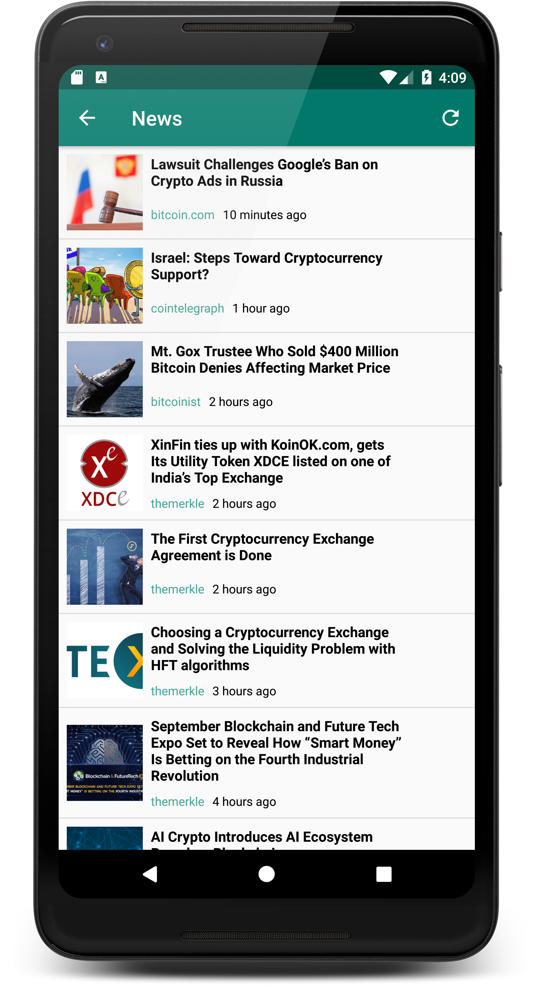

# CryptoBuddy

Cryptobuddy is an Android app that tracks and displays prices, news, charts, markets, and fundamentals of over 1500 crypto currencies! The app is completely open source with NO ADS EVER! It was a labor of love. I have spent months working on it every night after I get home from work and on weekends. 

## Libraries Used

* <a href="https://github.com/fcopardo/EasyRest">EasyRest</a>: This library is used extensively for all network calls within the app. It takes care of request caching, multi-threading, and mashalling JSON into objects with Jackson
* <a href="https://github.com/afollestad/material-dialogs">material-dialogs</a>: Library used to show the sorting dialog 
* <a href="https://github.com/GoogleChrome/custom-tabs-client">customtabs</a>: Library used for the web browser with Chrome integrations
* <a href="https://github.com/nex3z/ToggleButtonGroup">ToggleButtonGroup</a>: Library used for the buttons which allow users to toggle the date range on the chart
* <a href="https://github.com/IvBaranov/MaterialFavoriteButton">MaterialFavoriteButton</a>: Library used for the favorite button on the home screen
* <a href="https://github.com/PhilJay/MPAndroidChart">MPAndroidChart</a>: Used to show price over time chart
* <a href="http://square.github.io/picasso/">Picasso</a>: Library used for hassle-free image loading and display
* <a href="https://github.com/google/gson">GSON</a>: Library used to serialize text from the database into real Java objects and vice-versa

## Permissions
`android.permission.ACCESS_NETWORK_STATE`  
`android.permission.INTERNET`

These two permissions are required so that we can talk to the APIs on the internet that give us information about crypto currencies

## Sources
* <a href="https://min-api.cryptocompare.com/">CryptoCompare min-api</a>: This API is currently only used for Markets and News
* <a href="https://coinmarketcap.com/">CoinMarketCap</a>: Huge thanks to CoinMarketCap! Without their APIs this app would not be possible. They are the backend for chart data, coin images, market caps, volume, prices, and percent changes.
